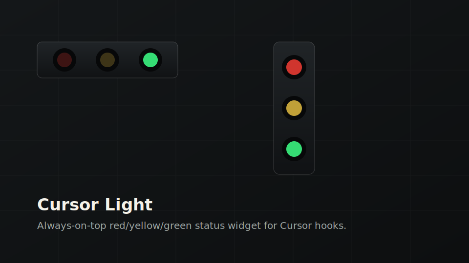

# Cursor Light

Cursor Light 是一个轻量级 Electron 桌面状态灯工具，用于监听 Cursor hooks，并通过红、黄、绿三色灯实时显示 Agent 当前状态。它适合放在屏幕角落，帮助你不用盯着 Cursor 面板也能知道 Agent 正在执行、已经完成，还是遇到了错误。



## 功能特性

- 监听 Cursor hooks，通过本地 HTTP 接收器更新灯色
- 红灯、黄灯、绿灯状态显示
- 始终置顶，适合做屏幕角落悬浮提示
- 支持拖动，靠近屏幕边缘自动吸附
- 支持右键切换横向和竖向布局
- 支持右键退出，并显示在 Windows 任务栏中
- 首次启动可自动配置 Cursor hooks
- 按屏幕尺寸自适应窗口大小
- 提供 Windows 安装包和便携版 exe 打包配置

## 状态含义

| 灯色 | 含义 |
| --- | --- |
| 绿灯 | 空闲、完成、成功 |
| 黄灯 | Agent 正在执行、思考、调用工具或命令 |
| 红灯 | 失败、拒绝、取消或异常 |

## 本地开发

### 环境要求

- Windows
- Node.js 22+
- npm
- Cursor

### 安装依赖

```powershell
npm.cmd install
```

### 启动应用

```powershell
npm.cmd start
```

应用会启动本地 hook 接收器：

```text
http://127.0.0.1:18765/hook
```

### 模拟灯色

```powershell
npm.cmd run simulate:yellow
npm.cmd run simulate:green
npm.cmd run simulate:red
```

## Cursor Hooks 配置

Cursor Light 通过 `hooks/cursor-hook.js` 把 Cursor hook 事件转发给桌面灯条。

应用启动时会检查：

```text
C:\Users\<你的用户名>\.cursor\hooks.json
```

如果没有检测到当前安装目录对应的 hook 配置，会先弹窗询问是否自动配置。选择 `自动配置` 后，应用会合并写入 hooks 配置，并备份旧文件为：

```text
C:\Users\<你的用户名>\.cursor\hooks.json.bak
```

配置完成后，需要重启 Cursor，或在 Cursor 中执行：

```text
Developer: Reload Window
```

已经在运行中的 Agent 请求不会补发开始事件。如果首次启动时选择跳过，也可以右键灯条，选择 `配置 Cursor Hooks` 重新触发自动配置。

### 手动配置示例

如果你想手动配置，可以参考：

```json
{
  "version": 1,
  "hooks": {
    "beforeSubmitPrompt": [
      {
        "command": "node D:\\DevWorkspace\\cursor-light\\hooks\\cursor-hook.js --event=beforeSubmitPrompt --status=yellow"
      }
    ],
    "afterAgentThought": [
      {
        "command": "node D:\\DevWorkspace\\cursor-light\\hooks\\cursor-hook.js --event=afterAgentThought --status=yellow"
      }
    ],
    "afterShellExecution": [
      {
        "command": "node D:\\DevWorkspace\\cursor-light\\hooks\\cursor-hook.js --event=afterShellExecution --status=yellow"
      }
    ],
    "afterFileEdit": [
      {
        "command": "node D:\\DevWorkspace\\cursor-light\\hooks\\cursor-hook.js --event=afterFileEdit --status=yellow"
      }
    ],
    "afterAgentResponse": [
      {
        "command": "node D:\\DevWorkspace\\cursor-light\\hooks\\cursor-hook.js --event=afterAgentResponse --status=green"
      }
    ],
    "stop": [
      {
        "command": "node D:\\DevWorkspace\\cursor-light\\hooks\\cursor-hook.js --event=stop --status=green"
      }
    ]
  }
}
```

## 打包 exe

项目使用 `electron-builder` 打包 Windows exe：

```powershell
npm.cmd install
npm.cmd run dist
```

打包前请先退出正在运行的开发版灯条，否则 Windows 可能会占用 Electron 文件，导致构建卡在解包阶段。

打包产物会生成在 `dist` 目录：

- `Cursor Light-0.1.0-x64-nsis.exe`：安装包
- `Cursor Light-0.1.0-x64-portable.exe`：便携版

## Release 版安装说明

1. 打开 GitHub 仓库的 `Releases` 页面。
2. 下载 `Cursor Light-版本号-x64-nsis.exe` 安装包，或下载 `Cursor Light-版本号-x64-portable.exe` 便携版。
3. 如果使用安装包，双击安装并启动 `Cursor Light`。
4. 如果使用便携版，直接双击 exe 启动。
5. 首次启动时选择 `自动配置`。
6. 重启 Cursor，或执行 `Developer: Reload Window`。
7. 新发起一个 Agent 请求，灯条就会根据 hook 事件切换颜色。

安装包安装后，hook 脚本会被复制到应用资源目录。默认安装位置通常类似：

```text
%LOCALAPPDATA%\Programs\Cursor Light\resources\hooks\cursor-hook.js
```

如果安装时选择了其他目录，自动配置会使用实际运行中的应用资源路径。

hook 脚本需要系统能执行 `node` 命令。

## 常用脚本

```powershell
npm.cmd start
npm.cmd run dist
npm.cmd run simulate:yellow
npm.cmd run simulate:green
npm.cmd run simulate:red
```

## 许可证

MIT
